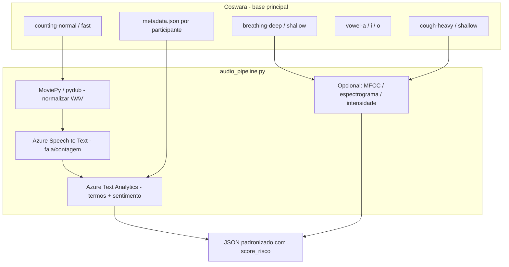

# Audio analysis reference review
_Exported on 7/11/2026 at 13:46:05 GMT-3 from Cursor (3.9.16)_

---

**User**

Analise as seguintes referencias 
@Tech Challenge-Fase4/DETALHAMENTO DO TECH_CHALENGE.txt:14-15 

Veja qual seria a base mais facil de se utilizar para atender a parte de analise de audio descrita em  @resumos/tech-challenge/plano-implementacao.md e @Tech Challenge-Fase4/DETALHAMENTO DO TECH_CHALENGE.txt +

---

**Cursor**

Vou ler os requisitos do Tech Challenge e do plano de implementação e, em seguida, comparar AudioSet e Coswara para a análise de áudio.

Buscando detalhes técnicos de Coswara e AudioSet para comparar adequação e facilidade de uso.

## Veredito: **Coswara é a base mais fácil e a mais adequada**

Para a **Seção 2 — Análise de áudio** do Tech Challenge, o **Coswara** atende melhor e com menos atrito que o **Google AudioSet**. A sugestão inicial do grupo está correta.

---

## O que o módulo precisa entregar

Pelos documentos do projeto, o módulo de áudio deve:

| Exigência | Onde aparece |
|-----------|--------------|
| Processar voz, tosse e respiração | `DETALHAMENTO` (linhas 71–74) |
| Extrair MFCC, espectrograma, intensidade, pausas | `DETALHAMENTO` (linha 73) — extensão opcional no plano |
| Transcrever com **Azure Speech to Text** | `plano-implementacao.md` (obrigatório) |
| Termos críticos e sentimento com **Azure Text Analytics** | `plano-implementacao.md` (obrigatório) |
| Detectar fadiga vocal, dificuldade respiratória, tosse alterada | Ambos |
| Saída JSON padronizada com `score_risco` | `DETALHAMENTO` (linhas 87–95) |

O plano divide em duas camadas:

- **Camada A (obrigatória):** MoviePy → Azure Speech → Azure Text Analytics  
- **Camada B (opcional):** análise acústica direta (MFCC, tosse/respiração) — o plano cita **Coswara** explicitamente como exemplo

---

## Comparação direta

| Critério | **Coswara** | **Google AudioSet** |
|----------|-------------|---------------------|
| **Propósito** | Sons respiratórios + fala para saúde respiratória | Classificação genérica de eventos sonoros (YouTube) |
| **Tipos de áudio** | 9 por participante: respiração (rápida/lenta), tosse (profunda/superficial), vogais, contagem (lenta/rápida) | 632 classes; respiração ~834 clipes, tosse ~871; fala ~1M+ |
| **Formato** | Arquivos de áudio prontos + metadados por pasta | CSV com IDs do YouTube + timestamps; áudio precisa ser baixado |
| **Download** | Script `extract_data.py` no GitHub, Kaggle ou Hugging Face | `gsutil` de features TFRecord **ou** scripts de terceiros para baixar do YouTube |
| **Tamanho** | ~65 h, ~2.600+ participantes | 2M+ clipes; balanced ~32 GB só de WAV |
| **Metadados clínicos** | Sintomas (`bd`=dificuldade respiratória, `ftg`=fadiga, tosse, febre…), status de saúde, idade, gênero | Só rótulo de classe (ex.: `"Cough"`, `"Breathing"`) |
| **Aderência ao cenário** | Alta — monitoramento respiratório/vocal | Baixa — clipes genéricos de YouTube, sem contexto clínico |
| **Facilidade no pipeline** | Alta — WAV por participante, estrutura previsível | Baixa — pipeline extra, ruído de fundo, sem `patient_id` |
| **Demo Azure Speech + Text** | Parcial — contagem/vogais em inglês; pouca fala livre em português | Parcial — fala variada, idiomas mistos, conteúdo não clínico |

---

## Por que o Coswara é mais fácil

### 1. Áudio já pronto, sem YouTube

O AudioSet **não distribui WAV direto**. Você recebe CSV com `youtube_id`, `start_time`, `end_time` e rótulos. Para usar no `audio_pipeline`, é preciso:

- baixar vídeos do YouTube;
- recortar clipes de 10 s;
- lidar com vídeos removidos/indisponíveis;
- filtrar classes relevantes manualmente.

O Coswara já vem com **arquivos de áudio organizados por participante**, com script de extração no repositório oficial: [iiscleap/Coswara-Data](https://github.com/iiscleap/Coswara-Data).

### 2. Alinhamento com o domínio do projeto

O detalhamento pede análise de **voz, tosse e respiração** em contexto de monitoramento preventivo. O Coswara foi criado exatamente para isso (IISc Bangalore, paper em *Scientific Data* 2023).

O AudioSet tem classes `Breathing` e `Cough`, mas com **pouquíssimas anotações** (~800–900 cada) em meio a milhões de clipes genéricos — difícil montar um dataset clínico coerente.

### 3. Metadados que ajudam no score de risco

No Coswara, cada participante traz metadados como:

- `bd` — breathing difficulties  
- `ftg` — fatigue  
- `cough`, `fever`, etc.  
- status COVID (healthy / positive / recovered)

Isso permite **validar** o pipeline e calibrar regras de alerta, por exemplo:

> “áudio com padrão de tosse alterada + metadado `bd=yes` → `score_risco` alto”

No AudioSet isso **não existe**.

### 4. Camada B (MFCC / espectrograma) encaixa naturalmente

O blog do Coswara documenta extração de MFCC e análise por categoria — alinhado à linha 73 do detalhamento e à Camada B do plano.

### 5. Volume gerenciável para um trabalho acadêmico

~65 h e milhares de participantes é suficiente para demo e testes, sem o peso de baixar 32 GB+ do AudioSet balanced (ou muito mais no unbalanced).

---

## Limitações do Coswara (e como contornar)

| Limitação | Impacto | Mitigação prática |
|-----------|---------|-------------------|
| Fala principalmente em **inglês** (contagem, vogais) | Azure configurado em `pt-BR` pode transcrever mal | Usar Coswara para **respiração/tosse** (Camada B) + gravar 2–3 áudios curtos em português para demo da **Camada A** (Speech + Text Analytics) |
| Não são consultas médicas reais | Demo de termos como “falta de ar” pode ficar fraca só com Coswara | Gravar roteiro simulado em PT-BR ou usar amostras sintéticas para Text Analytics |
| Kaggle pode estar desatualizado | Versão incompleta | Preferir [GitHub oficial](https://github.com/iiscleap/Coswara-Data) ou [Hugging Face](https://huggingface.co/datasets/szzs1693/coswara-data) |
| Idioma ≠ cenário brasileiro | Menor realismo semântico | Documentar no relatório como limitação |

---

## Quando o AudioSet faria sentido

Só vale como **complemento**, não como base principal:

- ampliar variedade de tosse/respiração para classificação acústica;
- treinar detector de eventos sonoros genérico;
- comparar modelos de áudio em escala.

Para o MVP do Tech Challenge, o custo de setup **não compensa**.

---

## Recomendação prática de uso

**Estratégia sugerida:**

1. **Base:** Coswara (GitHub oficial, subconjunto de ~20–50 participantes para desenvolvimento).  
2. **Por tipo de áudio:**
   - `breathing-*` e `cough-*` → análise acústica (intensidade, MFCC) + score heurístico  
   - `counting-*` → Azure Speech (pausas, taxa de fala, confiança)  
   - metadados → cruzar sintomas (`bd`, `ftg`) com resultado do pipeline  
3. **Demo em português:** 1–3 áudios gravados com frases como *“estou com falta de ar”*, *“cansaço”*, *“dor no peito”* para mostrar Text Analytics em `pt-BR`.  
4. **AudioSet:** não usar no MVP; só se sobrar tempo e quiser experimento extra.

---

## Conclusão

| Pergunta | Resposta |
|----------|----------|
| Qual é mais fácil de manipular? | **Coswara** |
| Qual atende melhor voz/tosse/respiração? | **Coswara** |
| Qual cobre o obrigatório Azure? | **Ambos** (como entrada WAV), mas Coswara + amostras PT-BR é o caminho mais simples |
| Manter a sugestão inicial do grupo? | **Sim** |

O Coswara é a escolha certa para a base de áudio. O ponto de atenção real não é Coswara vs AudioSet, e sim **complementar com áudio em português** para a demo obrigatória do Azure Speech + Text Analytics — porque o Coswara é forte em sinais respiratórios, mas fraco em consultas clínicas em `pt-BR`.

Se quiser, no próximo passo posso montar um **roteiro de subconjunto do Coswara** (quais pastas baixar, estrutura em `data/raw/` e mapeamento direto para o `audio_pipeline.py`).

