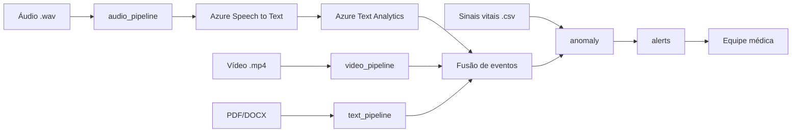

# Plano de Implementação — Tech Challenge Fase 4

## 1. Resumo executivo

Sistema de **monitoramento clínico multimodal** que ingere vídeo, áudio e texto, processa cada modalidade com as técnicas ensinadas no curso, funde os resultados, aplica **detecção de anomalias** e dispara **alertas** para a equipe médica.

- **Vídeo:** OpenCV + MediaPipe Pose (postura/movimento) + DeepFace/face_recognition (identidade/expressão) → substitui OpenPose/YOLOv8 do enunciado.
- **Áudio (Seção 2 do enunciado — obrigatório):** MoviePy (extração local, Aula 04 M2) + **Azure Speech to Text** (transcrição) + **Azure Text Analytics** (termos críticos e sentimento).
- **Texto/documentos:** AWS Textract (OCR de laudos/PDF) + Comprehend + classificação (scikit-learn) + sumarização (Transformers).
- **Nuvem:** **Azure Cognitive Services** (áudio: Speech + Text Analytics, obrigatório) + **AWS** (Textract, Comprehend, S3) para documentos — atende "pelo menos DUAS opções" da secretaria.
- **Anomalias e alertas:** camada nova, aderente ao material via regras + estatística simples + NLP — marcada como **extensão necessária (não coberta na matéria)**.

## 2. Checklist de requisitos do enunciado

### Confirmação — Seção 2 do enunciado (Análise de Áudio)

Conforme `8IADT - Fase 4 - Tech challenge.pdf` (p. 3, item **2. Análise de Áudio**), os requisitos abaixo são **obrigatórios** neste projeto:

| # | Exigência do PDF | Serviço obrigatório |
|---|------------------|---------------------|
| 2.1 | Processar áudios de consultas médicas | Pipeline local (MoviePy) + Azure |
| 2.2 | Detectar alterações vocais (fadiga, disartria) | **Azure Speech** (metadados: confiança, pausas, taxa de fala) + **Text Analytics** (termos/sentimento) + heurísticas sobre transcrição |
| 2.3 | Utilizar **Azure Speech to Text** para transcrever e analisar os áudios | **Azure Speech to Text** |
| 2.4 | Identificar termos críticos e sentimentos | **Azure Text Analytics** |

> SpeechRecognition/Google/Whisper/Comprehend **não substituem** Azure na etapa de áudio. Comprehend permanece válido apenas para documentos clínicos (Seção 4.3).

| ID | Requisito | Como atender (baseado na matéria) | Gap/Extensão |
|----|-----------|-----------------------------------|--------------|
| R1 | Processar vídeos clínicos (fisioterapia/cirurgia) | `cv2.VideoCapture` + `VideoWriter` (Aula 01–03 M2) | — |
| R2 | Detectar movimentos fora do padrão | MediaPipe Pose + heurística `is_arm_up`/ângulos (Aula 03 M2) | Alternativa a OpenPose/YOLO |
| R3 | Gerar relatórios automáticos de vídeo | Agregar eventos por frame → JSON/`.txt`/`.docx` (`python-docx`, Aula 06) | — |
| R4 | Processar áudios de consultas | MoviePy `write_audiofile` (Aula 04 M2) → áudio `.wav` → **Azure Speech to Text** | Azure SDK = **extensão necessária (não coberta na matéria)** |
| R5 | Detectar alterações vocais (fadiga/disartria) | **Coberto pelo stack Azure (enunciado):** Speech (confiança/pausas/timestamps) + Text Analytics (termos como "cansaço", "fadiga") + heurísticas no texto (hesitação, repetição) | Análise acústica direta (MFCC, espectrograma, timbre) = **extensão opcional (não coberta na matéria)** |
| R6 | **Obrigatório:** Azure Speech to Text para transcrever e analisar áudios | `azure-cognitiveservices-speech`: `SpeechRecognizer` ou `SpeechConfig` + `recognize_once` / batch transcription (`pt-BR`) | **Obrigatório pelo enunciado (Seção 2); não coberto na matéria** |
| R7 | **Obrigatório:** Azure Text Analytics para termos críticos e sentimentos | `azure-ai-textanalytics`: `analyze_sentiment`, `recognize_entities`, `extract_key_phrases` sobre texto transcrito | **Obrigatório pelo enunciado (Seção 2); não coberto na matéria** |
| R8 | Detecção de anomalias em séries de sinais vitais | Estatística simples (z-score/limiares) sobre séries | **extensão necessária (não coberta na matéria)** |
| R9 | Anomalias em prescrições/evolução clínica | Regras + NLP (Comprehend/classificação) | **extensão necessária (não coberta na matéria)** |
| R10 | Anomalias de movimentação | Deriva das métricas de pose (R2) | **extensão necessária (não coberta na matéria)** |
| R11 | Alertas automáticos em tempo real | Camada `alerts.py` (regras → log/arquivo/webhook) | **extensão necessária (não coberta na matéria)** |
| R12 | Integração com nuvem (Azure Cognitive Services) | Azure Speech + Text Analytics (áudio) + AWS Textract/Comprehend/S3 (documentos) | Azure SDK = **extensão necessária (não coberta na matéria)** |
| R13 | OCR de laudos/exames em PDF/imagem | Textract `analyze_document` (Aula 02 M3) | — |
| R14 | Repositório Git + relatório técnico | Estrutura `src/tests/docs/` | — |
| R15 | Vídeo demonstrativo ≤15 min | Roteiro (seção 10) | — |

## 3. Arquitetura proposta (alto nível)

- **Ingestão:** arquivos de vídeo (`.mp4`), áudio (`.wav`), documentos (`.pdf`/`.docx`), séries de sinais vitais (`.csv`).
- **Processamento por modalidade:** pipelines independentes → saída normalizada (eventos/métricas com timestamp).
- **Fusão:** consolidar eventos por paciente/tempo em uma estrutura única.
- **Anomalias:** aplicar regras/estatística sobre a estrutura fundida.
- **Alertas:** classificar severidade → notificar equipe.



## 4. Especificação por modalidade

### 4.1 Vídeo

- **Pipeline (material):** `cv2.VideoCapture(path)` → por frame: BGR→RGB → `mp_pose.process` → `draw_landmarks(POSE_CONNECTIONS)` → `VideoWriter(codec 'mp4v')`. Opcional: `DeepFace.analyze(actions=['emotion'])` para dor/desconforto e `face_recognition` para identidade do paciente.
- **Como detectar "fora do padrão":** heurísticas sobre landmarks (Aula 03): comparar coordenadas `y`/ângulos entre juntas (ex.: `is_arm_up` → amplitude de movimento), contar repetições, detectar ausência/queda de movimento, ângulos fora de faixa esperada. Sinalizar frame como anômalo quando métrica cruza limiar.
- **Relatório automático (formato/conteúdo):** JSON + `.docx` (via `python-docx`, Aula 06) com: duração, nº de frames processados, contagem de movimentos, timestamps de eventos anômalos, emoção dominante agregada, e (opcional) resumo textual via `transformers pipeline("summarization")`.
- **OpenPose/YOLOv8:** não cobertos no material. **Alternativa aderente:** MediaPipe Pose (postura, equivalente funcional ao OpenPose) e, para "objetos/áreas críticas", ROI manual + Haarcascade (Aula 01). **Plano de extensão:** integrar `ultralytics` YOLOv8 em `detect_objects()` como módulo plugável — marcado **extensão necessária (não coberta na matéria)**.

### 4.2 Áudio

> **Confirmação — Seção 2 do enunciado (Análise de Áudio):** o PDF exige **obrigatoriamente** (1) processar áudios de consultas; (2) detectar alterações vocais (fadiga, disartria); (3) **utilizar Azure Speech to Text** para transcrever e analisar os áudios; (4) **identificar termos críticos e sentimentos com Azure Text Analytics**.

- **Pipeline local (matéria):** `moviepy VideoFileClip.audio.write_audiofile` (Aula 04 M2) — extrai `.wav` de vídeo ou recebe áudio direto.
- **Transcrição (obrigatório — Azure Speech to Text):** SDK `azure-cognitiveservices-speech` com `SpeechConfig(subscription=..., region=...)` e `SpeechRecognizer` (ou batch transcription para arquivos longos), idioma `pt-BR`. Saída: texto transcrito + metadados (confiança, duração).
- **Análise de texto transcrito (obrigatório — Azure Text Analytics):** SDK `azure-ai-textanalytics` com `TextAnalyticsClient`:
  - `analyze_sentiment` → sentimento geral (positivo/negativo/neutro/misto);
  - `recognize_entities` → entidades clínicas (sintomas, medicamentos);
  - `extract_key_phrases` → termos críticos (ex.: "falta de ar", "dor no peito", "cansaço", "tontura").
- **Alterações vocais (fadiga/disartria)** — duas camadas distintas:

  **Camada A — atendida pelo stack obrigatório do enunciado (Azure Speech + Text Analytics):**
  - **Azure Speech to Text** ("transcrever **e analisar**"): texto + metadados de confiança por palavra, timestamps e pausas → proxies de fala lenta, hesitante ou com baixa clareza (indício indireto de fadiga/disartria).
  - **Azure Text Analytics:** termos críticos verbalizados ("cansaço", "fadiga", "falta de ar", "tontura") via `extract_key_phrases` / `recognize_entities`; sentimento negativo via `analyze_sentiment`.
  - **Heurísticas em Python** sobre a transcrição: repetições, fragmentos ("é…", "ah…"), incoerência textual.

  **Camada B — extensão opcional (não coberta na matéria; não exigida pelo PDF):**
  - Análise acústica direta do sinal: MFCC, espectrograma, intensidade, prosódia, timbre vocal.
  - Necessária apenas para: disartria **sem** conteúdo semântico claro, tosse/respiração alterada (ex.: Coswara), ou "padrão vocal cansado" no sentido do **som**, não das palavras.
  - Referência interna do grupo: `DETALHAMENTO DO TECH_CHALENGE.txt` (linhas 73–74) — complemento, não substituto do Azure.
- **Saída padronizada (JSON):** conforme `DETALHAMENTO DO TECH_CHALENGE.txt` — `patient_id`, `modulo: "audio_texto"`, `tipo_anomalia`, `score_risco`, `nivel_risco`, `descricao`, `recomendacao`.
- **Nota:** SpeechRecognition/Google/Whisper **não** substituem Azure neste projeto — podem servir apenas como fallback de desenvolvimento local, mas a entrega deve demonstrar Azure.

### 4.3 Texto / documentos clínicos

- **PDFs/escaneados:** upload para S3 (`boto3.client('s3').upload_file`) → `textract.analyze_document(Document={'S3Object':...}, FeatureTypes=['TABLES','FORMS'])` → parse `response['Blocks']` filtrando `BlockType=='LINE'` → `texto_extraido.txt` (Aula 02 M3).
- **Análise de texto:** Comprehend (sentimento/entidades/frases-chave, Aula 03 M3); classificação de categorias com scikit-learn (Aula 05 M2); sumarização de laudos/evolução com Transformers (Aula 06 M2).
- **Relatório:** consolidar entidades/frases-chave/sentimento + resumo em `.docx`/JSON.

### 4.4 Detecção de anomalias

Toda a seção é **extensão necessária (não coberta na matéria)** — o curso não aborda séries temporais/anomalias. Abordagens simples e justificáveis:

- **Séries temporais (batimentos, pressão, oxigenação):** limiares clínicos fixos + **z-score/desvio de média móvel** com `numpy`/`pandas` (bibliotecas já do inventário M3). Marcar ponto como anômalo quando |z| > k ou fora de faixa fisiológica.
- **Prescrições/evolução clínica:** **regras** (mudanças bruscas de dose/medicação) + **NLP** (Comprehend/classificação) para detectar termos de risco na evolução.
- **Movimentação:** reutiliza métricas de pose (4.1) — queda abrupta de atividade ou ausência prolongada de movimento.
- **Critérios de alerta:** severidade por nº/gravidade de anomalias simultâneas (baixa/média/alta); alta = múltiplas modalidades ou vital fora de faixa crítica.

## 5. Estrutura do repositório

```
tech-challenge-fase4/
├── src/
│   ├── video_pipeline.py     # pose/expressão/identidade em vídeo
│   ├── audio_pipeline.py     # extração + transcrição + análise vocal
│   ├── text_pipeline.py      # Textract + Comprehend + sumarização
│   ├── anomaly.py            # séries vitais + prescrições + movimentação
│   ├── alerts.py             # regras de severidade + notificação
│   └── fusion.py             # consolidação multimodal de eventos
├── tests/                    # testes unitários por pipeline
├── docs/                     # relatório técnico, diagramas, prints
├── data/
│   ├── raw/                  # vídeos, áudios, PDFs, csv de sinais vitais
│   ├── processed/            # transcrições, texto_extraido, métricas
│   └── reports/              # relatórios .docx/.json gerados
├── requirements.txt          # (ou pyproject.toml com uv)
└── README.md
```

## 6. Inventário final de bibliotecas (somente as do inventário)

| Biblioteca | Onde aparece (aula) | Papel no projeto |
|------------|---------------------|------------------|
| `opencv-python` (`cv2`) | Aula 01–03 M2 | Leitura/escrita de vídeo, frames, desenho |
| `mediapipe` | Aula 03 M2 | Pose/landmarks para postura e movimento |
| `deepface` | Aula 02 M2 | Emoção/expressão facial (dor/desconforto) |
| `face_recognition` (+`dlib`) | Aula 01–02 M2 | Identidade do paciente |
| `numpy` | Aula 01 M2 / M3 | Vetores, z-score, cálculos de anomalia |
| `moviepy` | Aula 04 M2 | Extrair áudio de vídeo (pré-processamento local) |
| `azure-cognitiveservices-speech` | **Enunciado Seção 2** | **Obrigatório:** transcrição Azure Speech to Text |
| `azure-ai-textanalytics` | **Enunciado Seção 2** | **Obrigatório:** sentimento + termos críticos |
| `python-dotenv` | Aula 05 M4 | Carregar `AZURE_SPEECH_KEY`, `AZURE_TEXT_ANALYTICS_KEY` |
| `pydub` | Aula 04 M2 | Conversão/manipulação de áudio (formato WAV) |
| `scikit-learn` | Aula 05 M2 | Classificação de termos críticos |
| `gensim` / `nltk` | Aula 05 M2 | Tópicos (LDA) + stopwords |
| `python-docx` | Aula 06 M2 / Aula 05 M4 | Ler `.docx` e gerar relatórios |
| `transformers` (+`torch`) | Aula 06 M2 | Sumarização de laudos/evolução |
| `boto3` | Aula 02–03 M3 | S3 + Textract + Comprehend |
| `pandas` | Aula 02 M3 | Séries temporais de sinais vitais |
| `reportlab` | Aula 02 M3 | Geração de PDF (relatórios) |
| `openai` | Aula 02–05 M4 | Extração estruturada (opcional; não substitui Azure no áudio) |
| `Flask` | Aula 05 M4 | Endpoint de upload/integração |

## 7. Esqueletos de código (curtos, por módulo)

`src/video_pipeline.py`
```python
import cv2
import mediapipe as mp

def load_video(path): return cv2.VideoCapture(path)

def process_frame(frame, pose):
    results = pose.process(cv2.cvtColor(frame, cv2.COLOR_BGR2RGB))
    return results.pose_landmarks

def detect_anomaly(landmarks):  # extensão: heurística sobre ângulos/coords
    return is_out_of_pattern(landmarks)

def save_report(events, out_path): ...

def main(path):
    pose = mp.solutions.pose.Pose()
    cap, events = load_video(path), []
    while cap.isOpened():
        ok, frame = cap.read()
        if not ok: break
        lm = process_frame(frame, pose)
        if lm and detect_anomaly(lm.landmark): events.append(...)
    save_report(events, "data/reports/video.json")
```

`src/audio_pipeline.py`
```python
import moviepy.editor as mp
import azure.cognitiveservices.speech as speechsdk
from azure.ai.textanalytics import TextAnalyticsClient
from azure.core.credentials import AzureKeyCredential

def load_audio_from_video(video_path, wav_path):
    mp.VideoFileClip(video_path).audio.write_audiofile(wav_path); return wav_path

def process_transcription(wav_path, speech_key, speech_region):
    config = speechsdk.SpeechConfig(subscription=speech_key, region=speech_region)
    config.speech_recognition_language = "pt-BR"
    audio_config = speechsdk.audio.AudioConfig(filename=wav_path)
    recognizer = speechsdk.SpeechRecognizer(speech_config=config, audio_config=audio_config)
    result = recognizer.recognize_once()
    return result.text

def detect_critical_terms(text, ta_key, ta_endpoint):
    client = TextAnalyticsClient(ta_endpoint, AzureKeyCredential(ta_key))
    sentiment = client.analyze_sentiment([text])[0]
    entities = client.recognize_entities([text])[0]
    phrases = client.extract_key_phrases([text])[0]
    return {"sentiment": sentiment, "entities": entities, "key_phrases": phrases}

def save_report(data, path): ...

def main(video_path, speech_key, speech_region, ta_key, ta_endpoint):
    wav = load_audio_from_video(video_path, "data/processed/a.wav")
    text = process_transcription(wav, speech_key, speech_region)
    insights = detect_critical_terms(text, ta_key, ta_endpoint)
    save_report({"transcricao": text, **insights}, "data/reports/audio.json")
```

`src/text_pipeline.py`
```python
import boto3

def load_document_to_s3(path, bucket, key):
    boto3.client("s3").upload_file(path, bucket, key)

def process_textract(bucket, key):
    r = boto3.client("textract").analyze_document(
        Document={"S3Object": {"Bucket": bucket, "Name": key}},
        FeatureTypes=["TABLES", "FORMS"])
    return "\n".join(b["Text"] for b in r["Blocks"] if b["BlockType"] == "LINE")

def detect_insights(text):
    c = boto3.client("comprehend")
    return {
        "sentimento": c.detect_sentiment(Text=text, LanguageCode="pt")["Sentiment"],
        "entidades": c.detect_entities(Text=text, LanguageCode="pt")["Entities"],
        "frases": c.detect_key_phrases(Text=text, LanguageCode="pt")["KeyPhrases"],
    }

def main(path, bucket, key):
    load_document_to_s3(path, bucket, key)
    detect_insights(process_textract(bucket, key))
```

`src/anomaly.py`  *(extensão necessária — não coberta na matéria)*
```python
import numpy as np, pandas as pd

def load_vitals(csv_path): return pd.read_csv(csv_path)

def detect_series_anomaly(series, k=3.0):
    z = (series - series.mean()) / (series.std() + 1e-9)
    return series[np.abs(z) > k]

def detect_prescription_anomaly(records):  # regras + NLP
    return [r for r in records if r["dose_delta_pct"] > 50]

def save_anomalies(items, path): ...

def main(csv_path):
    df = load_vitals(csv_path)
    return {c: detect_series_anomaly(df[c]) for c in ["bpm", "spo2", "pressao"]}
```

`src/alerts.py`  *(extensão necessária — não coberta na matéria)*
```python
def load_anomalies(path): ...

def process_severity(anomalies):
    n = len(anomalies)
    return "alta" if n >= 3 else "media" if n == 2 else "baixa"

def detect_alert(anomalies): return len(anomalies) > 0

def save_alert(alert, path): ...

def main(anomalies):
    if detect_alert(anomalies):
        sev = process_severity(anomalies)
        save_alert({"sev": sev, "itens": anomalies}, "data/reports/alertas.json")
```

## 8. Plano de implementação em fases (MVP → final)

| Fase | Escopo | Entregas |
|------|--------|----------|
| F0 – Setup | Repo, `uv`/`requirements.txt`, credenciais **Azure** (Speech + Text Analytics) e AWS | Repositório inicial + README |
| F1 – MVP Vídeo | `video_pipeline` com MediaPipe + heurística + relatório JSON | Vídeo anotado + relatório |
| F2 – MVP Áudio | `audio_pipeline` (MoviePy + **Azure Speech to Text** + **Azure Text Analytics**) | Transcrição + análise de sentimento/termos |
| F3 – Texto/Nuvem | `text_pipeline` (Textract + Comprehend) | Insights de laudo |
| F4 – Anomalias | `anomaly.py` (z-score + regras) sobre CSV de vitais | Lista de anomalias |
| F5 – Fusão + Alertas | `fusion.py` + `alerts.py` com severidade | Alertas consolidados |
| F6 – Relatório + Vídeo | Relatório técnico + gravação demo ≤15 min | Entregáveis finais |

## 9. Datasets do enunciado

- **PhysioNet (physionet.org):** fonte de **séries de sinais vitais** (batimentos, pressão, oxigenação) → entrada de `anomaly.py` (F4). Baixar CSV/registros e carregar com `pandas`.
- **Google AudioSet / Coswara:** áudios de fala, tosse e respiração → entrada de `audio_pipeline` → **Azure Speech to Text** → **Azure Text Analytics**. Coswara (Kaggle) é candidato principal para sinais respiratórios/vocais.

## 10. Entregáveis

**Estrutura do relatório técnico**
1. Contexto e objetivo.
2. Arquitetura multimodal (diagrama seção 3).
3. Modelos aplicados por modalidade (vídeo/áudio/texto/anomalias).
4. Decisões e substituições (por que MediaPipe em vez de OpenPose; **Azure obrigatório para áudio**; AWS para documentos).
5. Resultados + exemplos de anomalias detectadas.
6. Limitações e trabalhos futuros (extensões marcadas).

**Roteiro do vídeo (≤15 min)**
- 00:00–01:30 — Problema e visão geral da solução.
- 01:30–03:30 — Arquitetura e fluxo multimodal.
- 03:30–06:30 — Demo Vídeo (pose + evento anômalo + relatório).
- 06:30–09:00 — Demo Áudio (**Azure Speech to Text** + **Azure Text Analytics**: transcrição, termos críticos, sentimento).
- 09:00–11:00 — Demo Texto/Nuvem (Textract + Comprehend).
- 11:00–13:00 — Anomalias em sinais vitais + alerta gerado.
- 13:00–14:30 — Fusão e alerta final à equipe.
- 14:30–15:00 — Conclusões, limitações e extensões.

## 11. Riscos e mitigação

| Risco | Mitigação |
|-------|-----------|
| Dados faciais/voz = dados sensíveis (LGPD, citado Aula 01 M2) | Consentimento, anonimização, acesso restrito |
| Azure Speech/Text Analytics não cobertos na matéria | Documentar como extensão obrigatória pelo enunciado; seguir docs oficiais Microsoft |
| Credenciais Azure (Speech + Text Analytics) | `.env` com `AZURE_SPEECH_KEY`, `AZURE_SPEECH_REGION`, `AZURE_TEXT_ANALYTICS_KEY`, `AZURE_TEXT_ANALYTICS_ENDPOINT` |
| Custo/limites de API Azure + AWS | Cache de transcrições, batch quando possível, limitar chamadas em demo |
| Detecção de anomalias não coberta pela matéria | Manter simples/explicável (regras + z-score); documentar como extensão |
| Alterações vocais — limite do stack Azure | Camada A (Speech + Text Analytics + heurísticas) cobre o enunciado; documentar que disartria puramente acústica exige Camada B (MFCC) como extensão opcional |

## 12. Veredito final

**Atende 100% com a matéria:**
- Processamento de vídeo (pose/expressão/identidade), extração de áudio (MoviePy), OCR (Textract), análise de documentos (Comprehend/classificação/sumarização), geração de relatórios.

**Obrigatório pelo enunciado (Seção 2 — não coberto na matéria, mas mandatório):**
- **Azure Speech to Text** (transcrição + análise via metadados: confiança, pausas, timestamps).
- **Azure Text Analytics** (termos críticos + sentimento sobre texto transcrito).
- **Detecção de alterações vocais (R5):** atendida pela **Camada A** (Speech + Text Analytics + heurísticas) — suficiente para o PDF; não exige MFCC.
- Integração Azure demonstrada no vídeo de entrega (exigido no PDF, p. 4).

**Depende de extensão (e como reduzir risco):**
- **OpenPose/YOLOv8:** usar MediaPipe (já cobre postura); YOLOv8 opcional plugável — risco baixo.
- **Detecção de anomalias / alertas em tempo real:** não cobertos; reduzir risco mantendo abordagens simples e bem documentadas.
- **Análise acústica direta (Camada B — MFCC, tosse/respiração):** opcional; só necessária se o grupo quiser ir além do enunciado ou cobrir disartria sem conteúdo verbal.

## Final

**5 blocos do inventário decisivos:**
1. Pose + contagem de movimento (`is_arm_up`, `mp_pose.process`) — **Aula 03 M2 (PDF)** → base de vídeo e movimentação.
2. Vídeo→áudio (`write_audiofile`) — **Aula 04 M2 (PDF)** → pré-processamento local antes do Azure Speech.
3. Textract `analyze_document` + parse de `Blocks` — **Aula 02 M3 (PDF)** → OCR de laudos.
4. Comprehend `detect_sentiment/entities/key_phrases` — **Aula 03 M3 (PDF)** → análise de documentos clínicos (não substitui Azure Text Analytics no áudio).
5. Sumarização `pipeline("summarization")` sobre `.docx` — **Aula 06 M2 (PDF)** → relatórios automáticos.

**Extensões obrigatórias pelo enunciado (Seção 2):**
- **Azure Speech to Text** — transcrição de áudios de consultas.
- **Azure Text Analytics** — termos críticos e sentimento sobre transcrição.

**3 decisões humanas antes de codar:**
1. **Dataset de áudio:** Coswara (Kaggle) **ou** AudioSet (Google) para amostras de tosse/respiração/fala?
2. **Detecção de objetos em vídeo:** ficar só com MediaPipe **ou** adicionar YOLOv8 como extensão?
3. **Origem dos sinais vitais:** dataset PhysioNet/eICU real **ou** CSV sintético para a demo?
